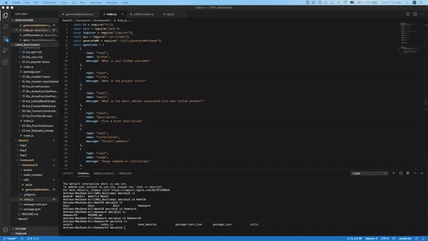

Homework 9 : README Generator

This application will prompt the user for Github username, project title, email address, a brief project description, install commands, usage commands or instructions,k contributors and test commands to generate a readme.md file for a repo.

The application will run on     node index.js

Animation of application:

